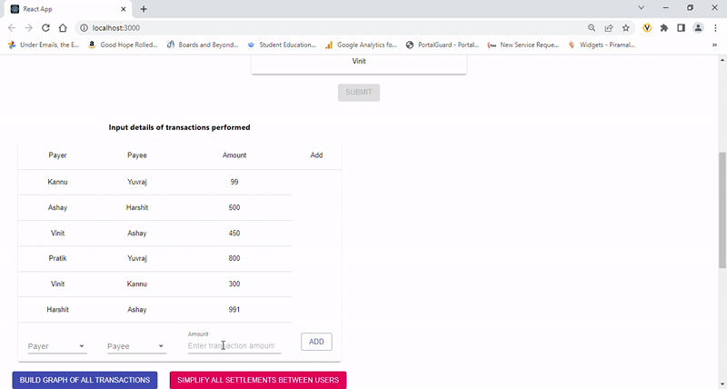
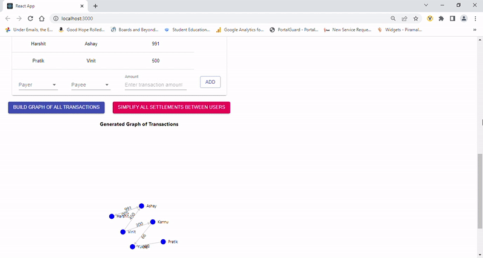

# Splitwise, visualized.

This program doesn't do anything that's never been done before. It's simply my implementation of Splitwise, a popular app to track and simplify cashflow between a group of friends. The aim is to see if a graph where people involved in transactions are the nodes and edges are the transactions between two nodes could be used to simplify the problem. I will start with a naive method and progress to algorithms like SSSP to find an optimal solution if the naive approach is time or computationally expensive.  

Essentially, if A owes money to B who owes money to C, then we can essentially eliminate B from the equation (contingent on the amounts owed between A, B and C). The goal of the algorithm is to minimize the number of transactions between all participants so that no redundant cashflow is generated.

## Demo
### Adding participants

___
### Adding transactions

___
### Creating (unsimplified) graph

___
### Creating simplified graph

___

## How does it work?
Naive Approach to solving this problem:
First, we take in all the transactions and exchanges that have happened among the group of people. We use a function which is used to calculate every individual's net balance. 

Based on their net balances, we can segregate the people into 2 categories - 
<ul>
<li>those who owe money </li>
<li>those who are owed money</li>
</ul>

A person is said to come under <i>credit</i> if his/ her net balance is <i>greater than</i> 0. This means that this person has to get his money back. 
Likewise, a person is said to come under <i>debit</i> if his/ her balance is <i>lesser than</i> 0. This means this person owes money to someone else. 
(If the net balance of an individual is 0, that means that he/ she need not give nor receive any money and they have been <i>settled</i>. 
Such people will no longer be taken into consideration for further transaction settlements).

Next, we create two heaps:

<ul>
<li>Credit Heap - which contains people who hold credit</li>
<li>Debit Heap - which contains people who hold debit</li>
</ul>

Both these heaps are set up as Max Heaps, wherein the root of the heap has the largest value. The value of each node is the *amount* that is either owed to or owed by the person, depending on which heap we are dealing with.

Seeing as the heaps are based on net balance, the nodes between the two will have no overlap. You can either owe money, or be owed money, or not be involved in the transaction.

Additionally, another interesting property of the two heaps is that the summation of the values of each node will be equal for both the heaps. 

These heaps have a property called *Heapify*, which is a very commonly known algorithm, hence won't be covered in this discussion.

For the next stage, we now have the person who owes the most money, and the person who is owed the most money. 

Trivially, we can eliminate one out of these two people (the person whose amount is lesser). For example, if person A (who is the root of the credit heap) is owed $100 and person B (who is the root of the debit heap) owes $120.

We can clearly remove A from the further calculations by popping A from the credit heap entirely (A is now owed $0), and setting it such that B now owes $20. We add this transaction to the simplified transaction matrix.

To accomplish this, we pop B from the debit heap as well. We then add it back to the heap however with the new amount of $20 instead of $120. 

We then repeat this in a loop until both heaps are empty (it is impossible for only 1 to be empty). 

We now have our simplified transaction list.
